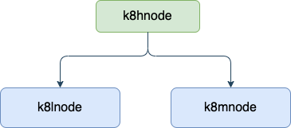

# k8s-ws
Home lab K8s setup on a 3 node cluster (old laptops)

## Overview
To setup k8s cluster on 3 nodes on old laptops. 

## Structure


- **Servers**
    - Master (k8hnode)
        - OS: Ubuntu 20.04.2 LTS x86_64
        - Kernel: 5.4.0-77-generic
        - CPU: Intel i5-4200U (4) @ 2.600GHz
        - Memory: 7858MiB
        - Disk: 117G
    - Node 1 (k8lnode)
        - OS: Ubuntu 20.04.2 LTS x86_64
        - Kernel: 5.4.0-77-generic
        - CPU: Intel i7-8550U (8) @ 4.000GHz
        - Memory: 23947MiB
        - Disk: 916G
    - Node 2 (k8mnode)
        - OS: Ubuntu 20.04.2 LTS x86_64
        - Kernel: 5.4.0-77-generic
        - CPU: Intel i5-8265U (8) @ 3.900GHz
        - Memory: 7769MiB
        - Disk: 234G

## Getting everything ready
OS of choice is Ubuntu Server v20.04. It is a LTS version and since I am familiar to it, gets the work done.
Install and setup ubuntu server on all 3 servers. Remember to chose to install Openssh server on each during server installation. This lets you easliy login to the nodes for further setup.

- **Tidy up the setup**
    - [Remove Snaps](https://www.kevin-custer.com/blog/disabling-snaps-in-ubuntu-20-04/)
    
        Snaps are great. We dont need them.
        - Check preinstalled snaps, `snap list`
            ```
            Name    Version   Rev    Tracking       Publisher   Notes
            core18  20210507  2066   latest/stable  canonical✓  base
            lxd     4.0.6     20326  4.0/stable/…   canonical✓  -
            snapd   2.51      12159  latest/stable  canonical✓  snapd
            ```
        - Remove the packages
            ```
            sudo snap remove lxd
            sudo snap remove core18
            sudo snap remove snapd
            ```
        - Unmount the snap mount points
        Run `df`. If you find an entry that looks like `/snap/core/xxxx`, unmount it. xxxx will be diffeerent in your setup.
            ```
            sudo umount /snap/core/xxxx
            ```
        - Remove and purge the snapd package
            ```
            sudo apt purge snapd
            ```
        - Remove any lingering snapd folders
            ```
            rm -rf ~/snap
            sudo rm -rf /snap
            sudo rm -rf /var/snap
            sudo rm -rf /var/lib/snapd
            ```
