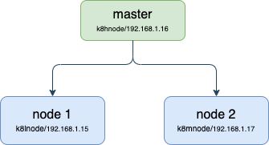

# k8s-ws
Home lab K8s setup on a 3 node cluster (old laptops)

## Overview
To setup k8s cluster on 3 nodes on old laptops. 

## Structure

- **Servers**
    - Master (k8hnode)
        - OS: Ubuntu 20.04.2 LTS x86_64
        - Kernel: 5.4.0-77-generic
        - CPU: Intel i5-4200U (4) @ 2.600GHz
        - Memory: 7858MiB
        - Disk: 117G
    - Node 1 (k8lnode)
        - OS: Ubuntu 20.04.2 LTS x86_64
        - Kernel: 5.4.0-77-generic
        - CPU: Intel i7-8550U (8) @ 4.000GHz
        - Memory: 23947MiB
        - Disk: 916G
    - Node 2 (k8mnode)
        - OS: Ubuntu 20.04.2 LTS x86_64
        - Kernel: 5.4.0-77-generic
        - CPU: Intel i5-8265U (8) @ 3.900GHz
        - Memory: 7769MiB
        - Disk: 234G

## Getting everything ready
OS of choice is Ubuntu Server v20.04. It is a LTS version and since I am familiar to it, gets the work done.
Install and setup ubuntu server on all 3 servers. Remember to chose to install Openssh server on each during server installation. This lets you easliy login to the nodes for further setup.

- **Tidy up the setup**
    - [Remove Snaps](https://github.com/amsen/k8s-ws/wiki/Remove-Snaps)
    - [Configure Static IP Address](https://github.com/amsen/k8s-ws/wiki/Configure-Static-IP-Address-in-Ubuntu)
